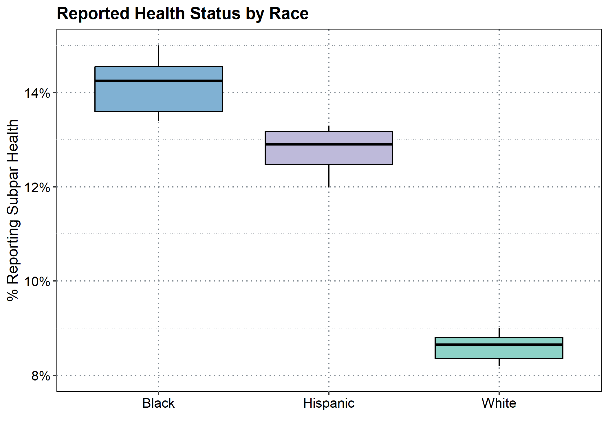
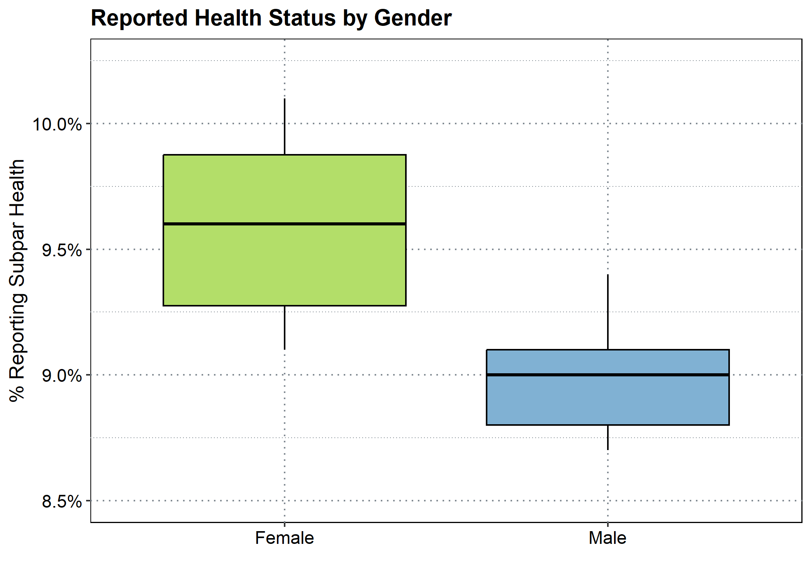
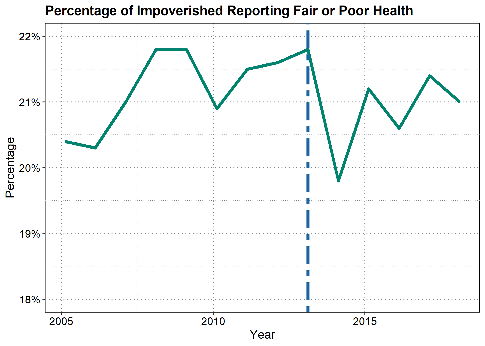

## Data Exploration

This simple demonstration will explore the impact of the increase in
Medicaid eligibility as a percentage of the federal poverty line.

I will be exploring trends in four separate data sets. First, I will
look at the number of emergency room visits per thousand Americans, pear
year, as measured by the [Kaiser Family
Foundation](https://www.kff.org/other/state-indicator/emergency-room-visits-by-ownership/?activeTab=graph&currentTimeframe=0&startTimeframe=16&selectedDistributions=total&selectedRows=%7B%22wrapups%22:%7B%22united-states%22:%7B%7D%7D%7D&sortModel=%7B%22colId%22:%22Location%22,%22sort%22:%22asc%22%7D):

    ## [1] "Emergency Room Visits Per Thousand Americans"

    ##    Min. 1st Qu.  Median    Mean 3rd Qu.    Max. 
    ##   372.0   400.5   415.5   415.4   437.0   445.0

Second, I will explore the percentage of Americans who report foregoing
medical care due to cost per year with data from the [State Health Data
Compare Assistance
Center](https://statehealthcompare.shadac.org/landing/178/percent-of-adults-who-could-not-get-medical-care-when-needed-due-to-cost-by-total-2011-to-2021)
:

    ## [1] "Percentage of Americans Reporting Foregoing Medical Care Due to Cost"

    ##    Min. 1st Qu.  Median    Mean 3rd Qu.    Max. 
    ## 0.09881 0.13262 0.13523 0.13790 0.14630 0.16928

Third, I will examine the net assets and debts of Americans in the
lowest 20th percentile of income earners per year using data from the
[Federal Reserve’s Consumer Finances
Survey](https://www.federalreserve.gov/econres/scf/dataviz/scf/chart/#series:Before_Tax_Income;demographic:inccat;population:1;units:median;range:1989,2019):

    ## [1] "Assets and Debts of Lowest 20% of American Earners"

    ##      Assets           Debt       
    ##  Min.   :12.61   Min.   : 7.654  
    ##  1st Qu.:15.88   1st Qu.: 9.670  
    ##  Median :17.67   Median :10.739  
    ##  Mean   :21.49   Mean   :10.341  
    ##  3rd Qu.:26.15   3rd Qu.:11.395  
    ##  Max.   :36.11   Max.   :11.860

Finally, I will explore the reported health statuses of Americans per
year using data from the [Center for Disease
Control](https://www.cdc.gov/nchs/hus/topics/health-status.htm#explore-data).
This data reports the percentage of Americans claiming “fair” or “poor”
health by year.

This dataset separates health statuses by demographics, including
gender:

    ## [1] "Health Status by Gender"

    ##       Male             Female       
    ##  Min.   :0.08700   Min.   :0.09100  
    ##  1st Qu.:0.08800   1st Qu.:0.09275  
    ##  Median :0.09000   Median :0.09600  
    ##  Mean   :0.08979   Mean   :0.09600  
    ##  3rd Qu.:0.09100   3rd Qu.:0.09875  
    ##  Max.   :0.09400   Max.   :0.10100

Race:

    ## [1] "Health Status by Race"

    ##      White            Black           Hispanic     
    ##  Min.   :0.0820   Min.   :0.1340   Min.   :0.1200  
    ##  1st Qu.:0.0835   1st Qu.:0.1360   1st Qu.:0.1247  
    ##  Median :0.0865   Median :0.1425   Median :0.1290  
    ##  Mean   :0.0860   Mean   :0.1417   Mean   :0.1281  
    ##  3rd Qu.:0.0880   3rd Qu.:0.1455   3rd Qu.:0.1318  
    ##  Max.   :0.0900   Max.   :0.1500   Max.   :0.1330

And income level. These variables report health statuses for Americans
based on their income as a percentage of the federal poverty line (e.g.,
the variable “100to199pct” is the reported health status of individuals
earning between 100% and 199% of the poverty line).

    ## [1] "Health Status by Income Level"

    ##   Under100pct     Btwn100and199pct Btwn200and399pct    Over400pct     
    ##  Min.   :0.1980   Min.   :0.1420   Min.   :0.07900   Min.   :0.03900  
    ##  1st Qu.:0.2067   1st Qu.:0.1440   1st Qu.:0.08225   1st Qu.:0.04025  
    ##  Median :0.2110   Median :0.1490   Median :0.08400   Median :0.04250  
    ##  Mean   :0.2108   Mean   :0.1477   Mean   :0.08421   Mean   :0.04250  
    ##  3rd Qu.:0.2157   3rd Qu.:0.1500   3rd Qu.:0.08675   3rd Qu.:0.04375  
    ##  Max.   :0.2180   Max.   :0.1540   Max.   :0.09000   Max.   :0.04700

## Note on Health Disparities

The Center for Disease Control’s health status dataset allows us to
demonstrate that changes in health status will affect different
communities in different magnitues. As the above summary statistics
imply, black and hispanic Americans are much more likely to report
“poor” or “fair” health than White americans:

Similarly, women are more likely to report subpar health than men:

## Data Trends

This chart shows the median national eligibility limit for Medicaid
coverage, measured as a percentage of the federal poverty line (this
data was retrieved from the [Kaiser Family
Foundation](https://www.kff.org/medicaid/state-indicator/medicaid-income-eligibility-limits-for-parents/?currentTimeframe=0&selectedDistributions=january-2002--april-2003--july-2004--july-2005--july-2006--january-2008--january-2009--december-2009--january-2011--january-2012--january-2013--january-2014--january-2015--january-2016--january-2017--january-2018--january-2019--january-2020--january-2021--january-2022&selectedRows=%7B%22wrapups%22:%7B%22united-states%22:%7B%7D%7D%7D&sortModel=%7B%22colId%22:%22Location%22,%22sort%22:%22asc%22%7D)).
In 2013, the median eligibility leaps up to 138% due to the
implementation of the Affordable Care Act.

It is important to note that this is the *median* value rather than the
national eligibility limit.

The following data trends will attempt to identify trends that may have
been driven by this leap upwards to 138%, with the blue dashed line
signifying the implementation of the increased eligibility limit.

First, let’s look at trend in hospital visits:

The Affordable Care Act appears to have no impact on the number of
Americans visiting emergency rooms. There is a noticeable decline in
2020 which is almost certainly due to the Covid-19 public health
emergency rather than a delayed response to changes in Medicaid
eligibility.

Next let’s exlpore Americans foregoing medical care:

Unlike emergency room visits, the percentage of Americans foregoing care
due to cost burdens seems to have been impacted by the Affordable Care
Act. The percentage has seen a steady decline since 2013, with only 10%
reporting foregoing care in 2021.

Next we’ll look at assets and debts of the poorest Americans:

We would expect Medicaid expansion to have an impact on the personal
finances of the poorest Americans given (1) the increased financial
security and reduced risk of medical bankruptcy for those with health
insurance as opposed to the uninsured, and (2) the presences of
state-imposed asset ceilings restricting Medicaid eligibility regardless
of one’s income.

Unfortunately, this dataset only contains two data points after 2013 per
metric, per year, which does not give us a particularly thorough
understanding of the post-ACA trend. However, we can see that after
2013, the trend of declining assets and increasing debt appears to have
been disrupted.

Next, we’ll explore the health status of those living under the federal
poverty line:

There does not appear to be a cohesive narrative in this data. The
pattern is jagged, with the Medicaid expansion not appearing to have an
observable impact on the percentage of the impoverished reporting subpar
health. While there is a decline between 2013 and 2014, this is not a
compelling trend. The decline can be potentially be explained by
low-income Americans reporting improved health with the expectation that
they will attain health insurance, only to be left uninsured due to
*National Federation of Independent Business v. Sebelius* limiting the
expansion of state Medicaid programs or a lack of education or outreach
regarding eligibility and enrollment.

The same appears to be true for all income levels:

We can see a clear stratification between reported health status and
income level, with higher incomes corresponding with improved health and
less variation. However, no income strata appears to have seen a
significant change after the implementation of the Affordable Care Act.
