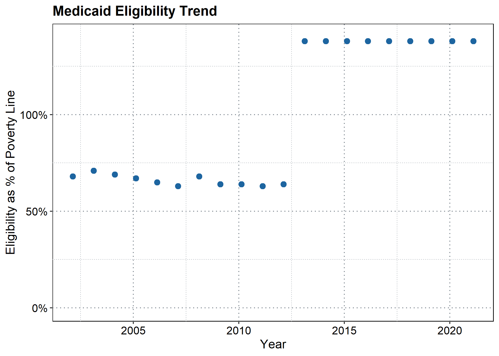
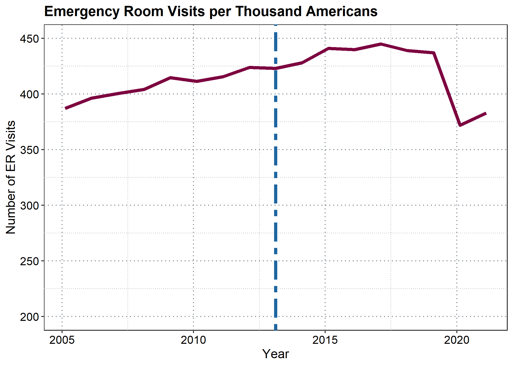

## Data Exploration

This exploration will look at the impact of the increase in Medicaid
eligibility as a percentage of the federal poverty line.

I will be exploring trends in four separate data sets. First, I will
look at the number of emergency room visits per thousand Americans, pear
year, as measured by the [Kaiser Family
Foundation](https://www.kff.org/other/state-indicator/emergency-room-visits-by-ownership/?activeTab=graph&currentTimeframe=0&startTimeframe=16&selectedDistributions=total&selectedRows=%7B%22wrapups%22:%7B%22united-states%22:%7B%7D%7D%7D&sortModel=%7B%22colId%22:%22Location%22,%22sort%22:%22asc%22%7D):

    ## [1] "Emergency Room Visits Per Thousand Americans"

    ##    Min. 1st Qu.  Median    Mean 3rd Qu.    Max. 
    ##   372.0   400.5   415.5   415.4   437.0   445.0

Second, I will explore the percentage of Americans who forego medical
care due to cost per year with data from the [State Health Data Compare
Assistance
Center](https://statehealthcompare.shadac.org/landing/178/percent-of-adults-who-could-not-get-medical-care-when-needed-due-to-cost-by-total-2011-to-2021)
:

    ## [1] "Percentage of Americans Reporting Foregoing Medical Care Due to Cost"

    ##    Min. 1st Qu.  Median    Mean 3rd Qu.    Max. 
    ## 0.09881 0.13262 0.13523 0.13790 0.14630 0.16928

Third, I will explore the net assets and debts of Americans in the
lowest 20th percentile of income earners per year using data from the
[Federal Reserve’s Consumer Finances
Survey](https://www.federalreserve.gov/econres/scf/dataviz/scf/chart/#series:Before_Tax_Income;demographic:inccat;population:1;units:median;range:1989,2019):

    ## [1] "Assets and Debts of Lowest 20% of American Earners"

    ##      Assets           Debt       
    ##  Min.   :12.61   Min.   : 7.654  
    ##  1st Qu.:15.88   1st Qu.: 9.670  
    ##  Median :17.67   Median :10.739  
    ##  Mean   :21.49   Mean   :10.341  
    ##  3rd Qu.:26.15   3rd Qu.:11.395  
    ##  Max.   :36.11   Max.   :11.860

Finally, I will explore the health statuses of Americans per year using
data from the [Center for Disease
Control](https://www.cdc.gov/nchs/hus/topics/health-status.htm#explore-data).
This data reports the percentage of Americans reporting “fair” or “poor”
health by year.

This dataset separates health statuses by demographics, including
gender:

    ## [1] "Health Status by Gender"

    ##       Male           Female      
    ##  Min.   :8.700   Min.   : 9.100  
    ##  1st Qu.:8.800   1st Qu.: 9.275  
    ##  Median :9.000   Median : 9.600  
    ##  Mean   :8.979   Mean   : 9.600  
    ##  3rd Qu.:9.100   3rd Qu.: 9.875  
    ##  Max.   :9.400   Max.   :10.100

Race:

    ## [1] "Health Status by Race"

    ##      White          Black          Hispanic    
    ##  Min.   :8.20   Min.   :13.40   Min.   :12.00  
    ##  1st Qu.:8.35   1st Qu.:13.60   1st Qu.:12.47  
    ##  Median :8.65   Median :14.25   Median :12.90  
    ##  Mean   :8.60   Mean   :14.17   Mean   :12.81  
    ##  3rd Qu.:8.80   3rd Qu.:14.55   3rd Qu.:13.18  
    ##  Max.   :9.00   Max.   :15.00   Max.   :13.30

And income level. These variables report health statuses for Americans
based on their income as a percentage of the federal poverty line (e.g.,
the variable “100to199pct” is the health status of individuals earning
between 100% and 199% of the poverty line).

    ## [1] "Health Status by Income Level"

    ##   Under100pct     100to199pct     200to399pct     Over400pct       
    ##  Min.   :19.80   Min.   :14.20   Min.   :7.900   Length:14         
    ##  1st Qu.:20.68   1st Qu.:14.40   1st Qu.:8.225   Class :character  
    ##  Median :21.10   Median :14.90   Median :8.400   Mode  :character  
    ##  Mean   :21.08   Mean   :14.77   Mean   :8.421                     
    ##  3rd Qu.:21.57   3rd Qu.:15.00   3rd Qu.:8.675                     
    ##  Max.   :21.80   Max.   :15.40   Max.   :9.000

## Data Trends

This trend shows the average percentage of the poverty line to qualify
for Medicaid coverage (this data was retrieved from the [Kaiser Family
Foundation](https://www.kff.org/medicaid/state-indicator/medicaid-income-eligibility-limits-for-parents/?currentTimeframe=0&selectedDistributions=january-2002--april-2003--july-2004--july-2005--july-2006--january-2008--january-2009--december-2009--january-2011--january-2012--january-2013--january-2014--january-2015--january-2016--january-2017--january-2018--january-2019--january-2020--january-2021--january-2022&selectedRows=%7B%22wrapups%22:%7B%22united-states%22:%7B%7D%7D%7D&sortModel=%7B%22colId%22:%22Location%22,%22sort%22:%22asc%22%7D)).
In 2013, the eligibility leaps up to 138% due to the implementation of
the Affordable Care Act.

The following data trends will attempt to identify trends that may have
been driven by this leap upwards to 138%.

First, let’s look at trend in hospital visits:

Then let’s look at Americans foregoing medical care:

Next we’ll look at assets and debts of the poorest Americans:

Health status of those under the poverty line:

